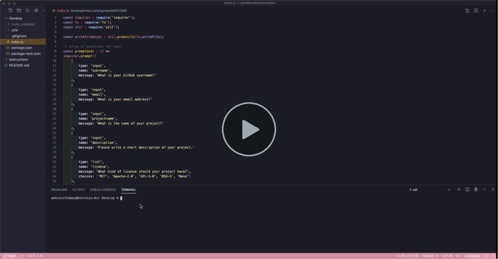
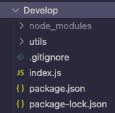
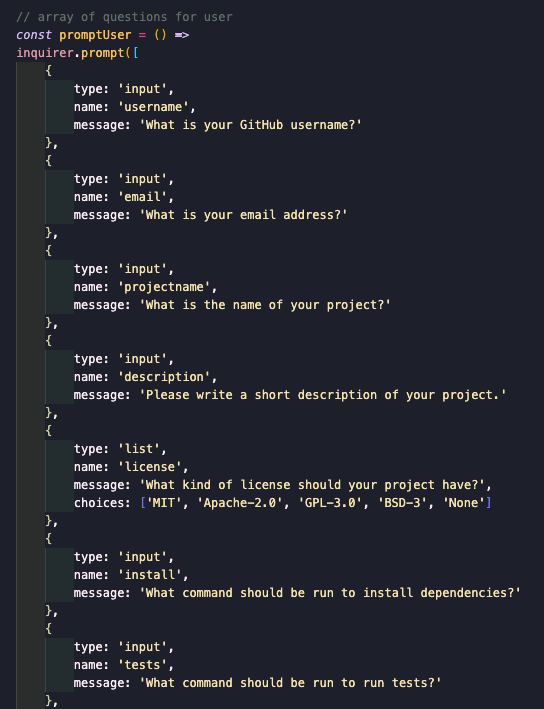
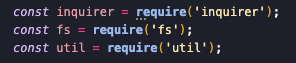
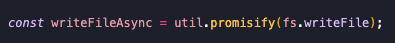
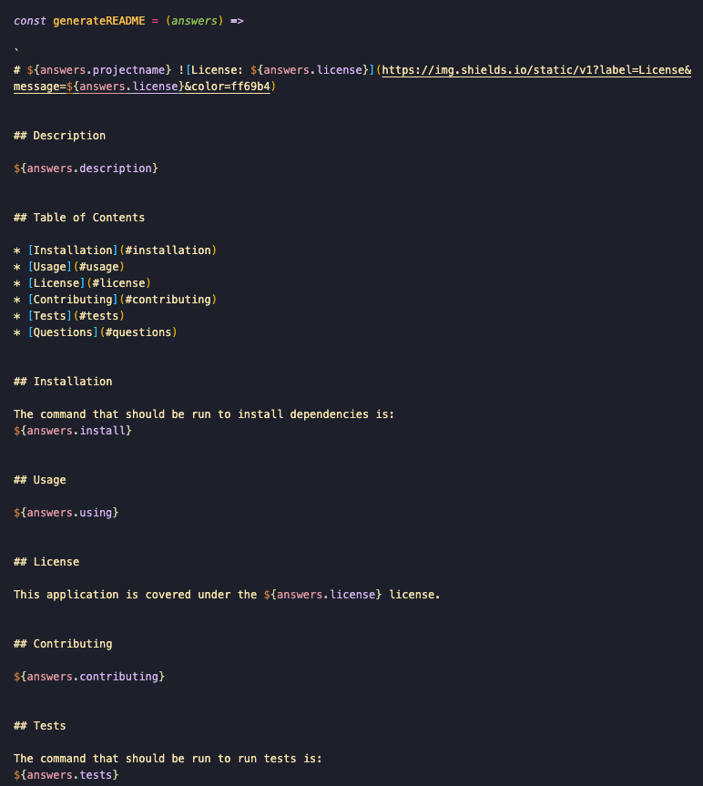
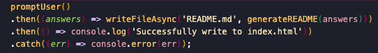

# goodReadmeGenerator

This README generator allows the user to quickly generate a professional README for a new project.

1. First I created a `.gitignore` file and then installed `package.json` using `npm init`

   

2. I used inquirer to create prompts for the user to answer

    

3. I created constants to load external modules

    

4. I created a function to create the README file and added the content it will contain

    

    

    
